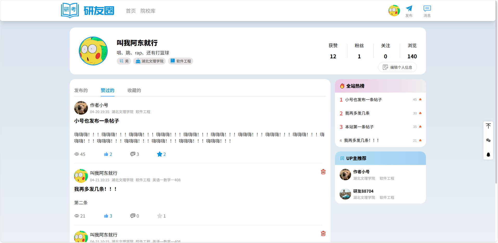
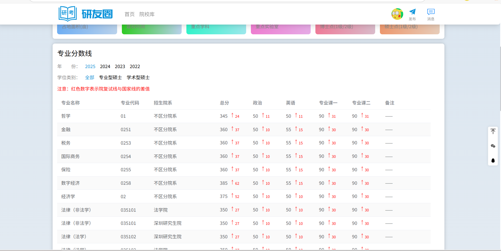
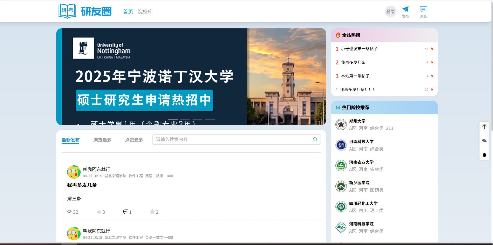
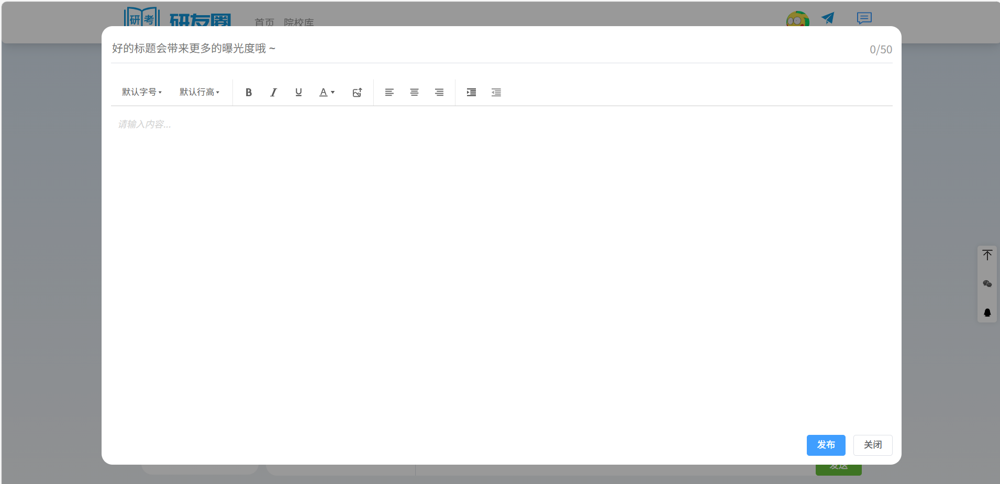
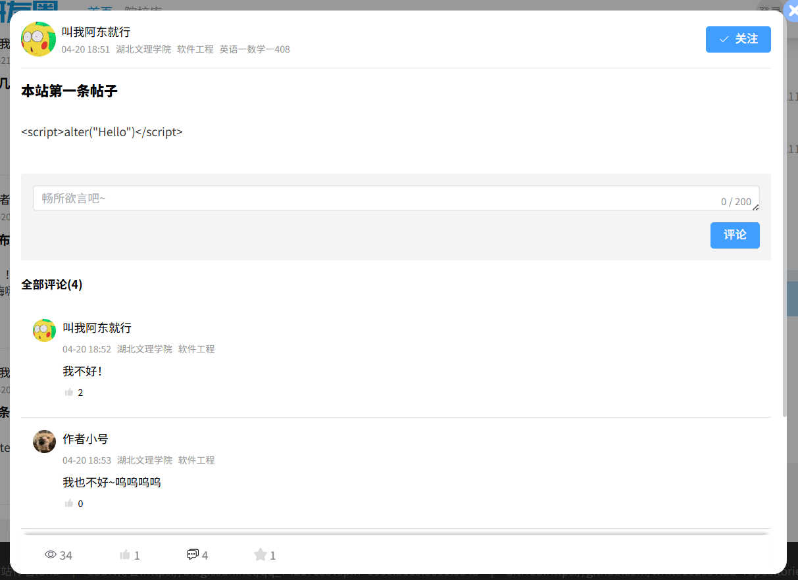
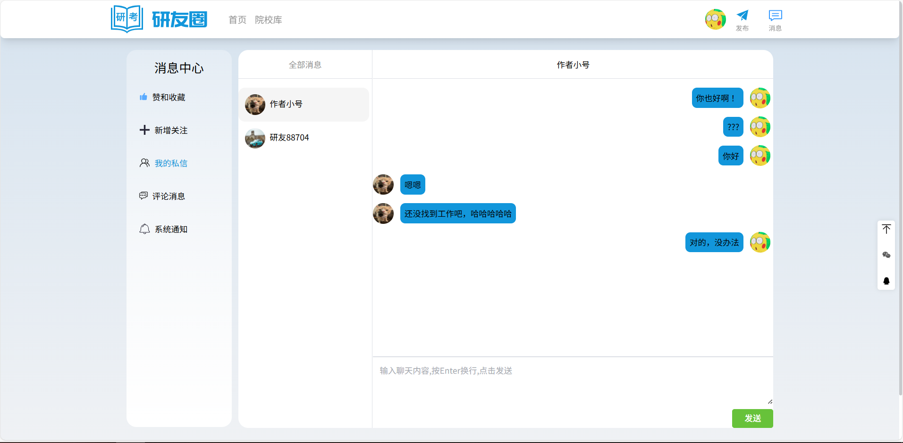
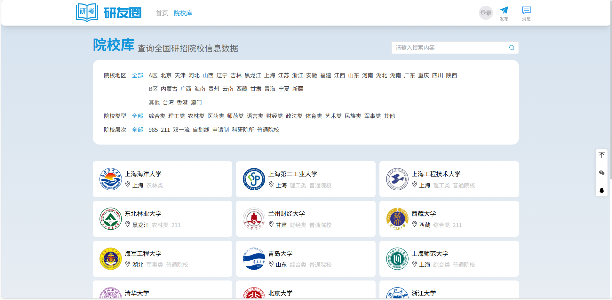
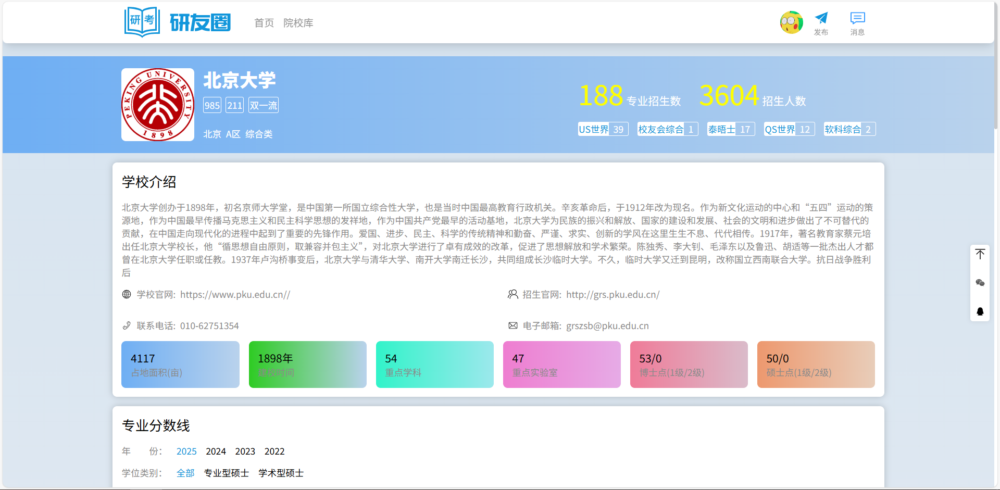

# 技术栈介绍
## 前端
1. Vue3
2. Vue-Router
3. ElementPlusUI
4. Vite

## 后端
1. Nestjs
2. x-crawl
3. Sequlize
4. MySql
5. WebSocket

# 功能介绍
1. 登陆注册
2. 个人信息管理
3. 社区发帖、删帖
4. 评论帖子、关注用户
5. 消息通知
6. 实时聊天
7. 院校考研信息爬取

# 运行环境
Node v20.17.0
Windows 10

# 系统效果图

